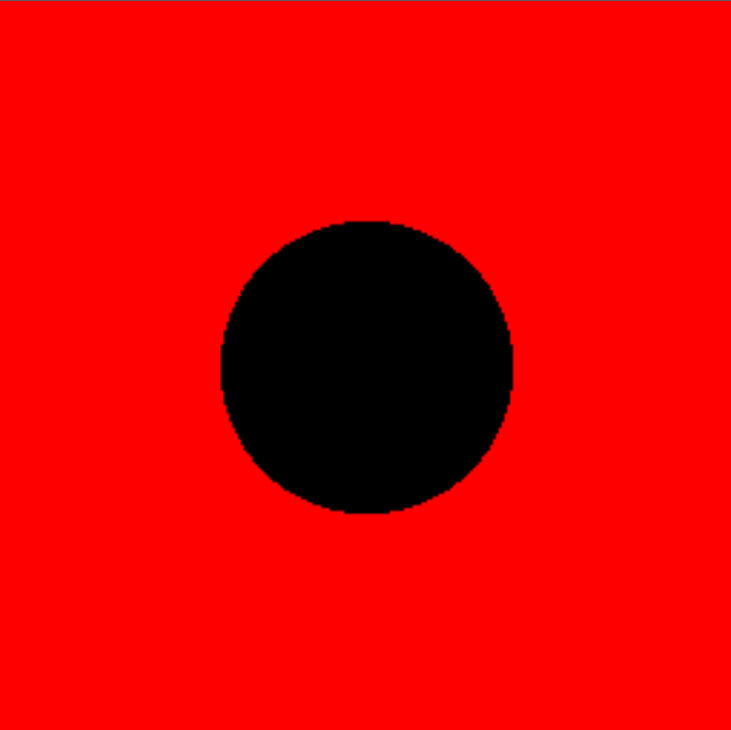
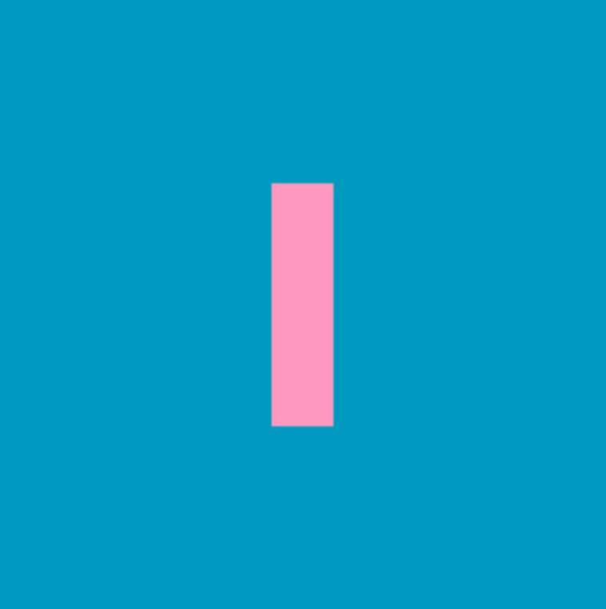
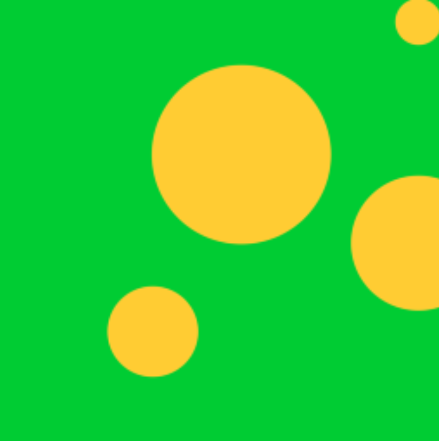

# TouchDesigner: Introduction to GLSL
**Study Guide & Developer Notes**

<!-- [https://thebookofshaders.com/00/](https://thebookofshaders.com/00/) -->

<!-- > You can think of \[shaders\] as the equivalent of Gutenberg's press for graphics -->

<!-- CodePen Embed example -->
<!-- <iframe height="760" style="width: 100%;" scrolling="no" title="Flexbox: Fill Vertical Space (100% Height) " src="https://codepen.io/micjamking/embed/preview/QdojLz?default-tab=result&theme-id=light" frameborder="no" loading="lazy" allowtransparency="true" allowfullscreen="true">
  See the Pen <a href="https://codepen.io/micjamking/pen/QdojLz">
  Flexbox: Fill Vertical Space (100% Height) </a> by Mike King (<a href="https://codepen.io/micjamking">@micjamking</a>)
  on <a href="https://codepen.io">CodePen</a>.
</iframe> -->

## 5.0 - Colors

The default pixel shader from a `GLSL TOP`:

```glsl
out vec4 fragColor;
main(){
  vec4 color = vec4(1.0);
  fragColor = TDOutputSwizzle(color);
}
```

In the above code, there are two important pieces:

```glsl
out vec4 fragColor;
```

This line defines an `out` (output) variable of type `vec4` (a vector containing 4 float values) called `fragColor`; this will be used as the output for our `main()` function.

```glsl
vec4 color = vec4(1.0);
```

This line creates a 4 channel color using a `vec4`. `vec4(1.0)` is shorthand and equivalent to `vec4(1.0, 1.0, 1.0, 1.0)`.

In pixel shaders, colors are defined as 4 channel float values, with each value representing the corresponding channel from an _RGBA_ color space:

```glsl
vec4 color = vec4(
  1.0, // Red
  1.0, // Green
  1.0, // Blue
  1.0, // Alpha
)
```

Each color channel ranges from 0.0-1.0, comparable to the 0-255 range in CSS/JS. The above `vec4(1.0)` is equivalent to `rgba(255,255,255,1.0)` and should display a white screen.


```glsl
vec4 color = vec4(1.0, 0.0, 0.5, 1.0);
```

The above should result in a pink color, mixing 100% of the red channel and 50% of the blue channel:


```glsl
vec4 color = vec4(1.0);
color.r = 0.2;
color.y = 0.8;
```

(See [0.5.1 - Swizzlin'](#051---swizzling) below)

The above should result in a baby blue color, mixing 20% of the red channel and 80% of the green channel, and 100% of the blue channel:


### 5.1 - Swizzlin'
The shorthand suffixes `.rgba`, `.xyzw`, and `.stpq` in GLSL are known as **swizzle masks** — they allow you to access or rearrange components of vector types (like `vec2`, `vec3`, `vec4`) using meaningful labels, depending on **context** or **semantic convention**.

Here’s what they map to and why you see them:

---

#### **Swizzle Mask Equivalents:**

| Meaning     | 2D Vectors    | 3D Vectors | Context                                |
| ----------- | ------------- | ---------- | ----------------------------------------- |
| Coordinates | `.xy`, `.xyz` | `.xyzw`    | Used in position, direction, general math |
| Colors      | `.rg`, `.rgb` | `.rgba`    | Used in color operations                  |
| Texture UVs | `.st`, `.stp` | `.stpq`    | Used in texture coordinate operations     |

---

In GLSL, `.stpq` is a semantic alias for `.xyzw`, used **when dealing with texture coordinates** or sampling.

This allows more expressive, readable code depending on what the vector represents:

* `.xyzw` → general-purpose math (position, velocity, etc.)
* `.rgba` → color data
* `.stpq` → texture coordinates

## 6.0 - Step Function

**The Coordinate System**

When working in  GLSL, we want the same code to run with all kinds of image resolutions... To achieve this, we can normalize our image space, ie. scaling the horizontal and vertical coordinates to be contained in a `0.0 - 1.0` range.

_Normalized clip-space:_
```
 top-left        top-right
 (0.0, 1.0)—————(1.0, 1.0)
 |                       |
 |                       |
 |                       |
 |                       |
 |                       |
 |                       |
 |                       |
 |                       |
 (0.0, 0.0)—————(1.0, 0.0)
 bottom-left  bottom-right
```

In GLSL, we do this by defining a new variable as the ratio between the window relative coordinate values and the resolution of our canvas:

```glsl
vec2 st = glFragCoord.xy / uResolution;
```

TouchDesigner has a built in variable for this named `vUV`.

**Mapping Coordinates to Colors**

```glsl
vec4 color = vec4(vUV.x, 0.0, 0.0, 1.0);
```

This should result in a horizontal, black-to-red gradient since we are mapping our `x` coordinate values to our red channel.


```glsl
vec4 color = vec4(vUV.y, 0.0, 0.0, 1.0);
```

This should result in a vertical, black-to-red gradient since we are mapping our `y` coordinate values to our red channel.


```glsl
vec4 color = vec4(vUV.x, vUV.y, 0.0, 1.0);
```

This should result in a green-red-yellow gradient, mapping our `x` coordinate values to our red channel, and `y` to our green channel, with both channels mixing in the top right corner to make yellow and both channels empty in the bottom left corner to make black.


**Colors with Step Function**

```glsl
vec4 color = vec4(step(0.5, vUV.x), 0.0, 0.0, 1.0);
```

The step function allows us to create shape by providing a threshold and mapping value. The above outputs a constant `0.0` value if the input value is less than the `0.5` threshold, or a constant `1.0` if the input value is equal to or greater than the threshold.


```glsl
vec4 color = vec4(step(0.75, vUV.x), step(0.5, vUV.y), 0.0, 1.0);
```

We can combine multiple step functions to draw basic shapes with code.


## 7.0 - Drawing Circles

To draw circles, we use the `length` function in combination with the `step` function:

```glsl
float myCircle = step(0.2, length(vUV.xy));
vec4 color = vec4(myCircle, 0.0, 0.0, 1.0);
```


### **What `length(vUV.xy)` Does**

This computes the distance from the origin `(0.0, 0.0)` to the current UV coordinate using the **Pythagorean Theorem**.

If you think of `vUV.xy` as a 2D point `(x, y)`, the `length()` function does:

$$
\text{length}(vUV.xy) = \sqrt{x^2 + y^2}
$$

This is the **distance from (0,0) to `(x, y)`** — the hypotenuse of a right triangle where the legs are `x` and `y`.

---

### **Why This Creates a Radial Shape**

As we move farther from `(0.0, 0.0)` (the bottom-left corner), the distance increases.

* At the bottom-left corner (0,0):

  $$
  \sqrt{0^2 + 0^2} = 0.0 \Rightarrow \text{black}
  $$
* At the top-right corner (1,1):

  $$
  \sqrt{1^2 + 1^2} = \sqrt{2} \approx 1.41 \Rightarrow \text{overshoots red > 1.0}
  $$

But **because the red channel only expects values between 0.0 and 1.0**, any result over 1.0 will get **clamped** (or wrapped, depending on how the shader is written or sampled).

So this code:

```glsl
vec4 color = vec4(length(vUV.xy), 0.0, 0.0, 1.0);
```

creates a radial red gradient that:

* **originates** from the **bottom-left corner (0,0)**
* **increases** in intensity as the distance from (0,0) increases
* fades from black to red following a **circular (radial)** pattern

Adding `step(0.2, length(vUV.xy))` establishes a hard boundary, thereby creating a distinct circle shape.

**Centering the circle**

```glsl
float myCircle = step(0.2, length(vUV.xy - 0.5));
vec4 color = vec4(myCircle, 0.0, 0.0, 1.0);
```

Moving the circle is simply a matter of minusing the normalized `x` and `y` coordinates of the target location from our normalized `x` and `y` pixel coordinates. In the above case, the center of the window is `(0.5, 0.5)`, so we can use the shorthand `vUV.xy - 0.5` to minus `0.5` from the current `x` and `y` values to move them to the center.



To invert the values, we can simply minus the value from `1.0`, ie. `1.0 - myCircle` or:

```glsl
float myCircle = step(0.2, length(vUV.xy - 0.5));
vec4 color = vec4(1.0 - myCircle, 0.0, 0.0, 1.0);
```


## 8.0 - Drawing Rectangles

Reusing the step function, we can create hard boundaries for each side of a quadrilateral.

```glsl
float myRectX = step(0.25, vUV.x) - step(0.75, vUV.x);
vec4 color = vec4(vec3(myRectX), 1.0);
```


Creating the hard boundary for the horizontal sides:

```glsl
float size = 0.5;
float myRectY = step(0.5 - (size/2), vUV.y) - step(0.5 + (size/2), vUV.y);
vec4 color = vec4(vec3(myRectY), 1.0);
```


...and finally combining them together to create a rectangle shape:

```glsl
vec2 size = vec2(0.65, 0.15);
vec2 pos = vec2(0.5, 0.5);

float myRectX = step(pos.x - (size.x/2), vUV.x) - step(pos.x + (size.x/2), vUV.x);
float myRectY = step(pos.y - (size.y/2), vUV.y) - step(pos.y + (size.y/2), vUV.y);
float myRect = myRectX * myRectY;

vec4 color = vec4(myRect, 0.45, 0.75, 1.0);
```


---

### **8.1 Understanding `step(edge, x)`**

Let's break down exactly **why** that GLSL code:

```glsl
step(0.25, vUV.x) - step(0.75, vUV.x);
```

produces a **vertical white bar in the middle**, flanked by **black bars** on the left and right.


GLSL’s `step()` function returns:

$$
\text{step}(e, x) = \begin{cases}
0.0 & \text{if } x < e \\
1.0 & \text{if } x \ge e
\end{cases}
$$

---

### **8.2 Expression Breakdown**

Let’s look at:

```glsl
float myRectX = step(0.25, vUV.x) - step(0.75, vUV.x);
```

This creates a **binary on/off mask** (1.0 or 0.0) **within a specific range** of the specified coordinate in UV space.

#### Case A: `vUV.x < 0.25`

* `step(0.25, vUV.x)` → **0.0**
* `step(0.75, vUV.x)` → **0.0**
* Result: `0.0 - 0.0 = 0.0`

#### Case B: `0.25 ≤ vUV.x < 0.75`

* `step(0.25, vUV.x)` → **1.0**
* `step(0.75, vUV.x)` → **0.0**
* Result: `1.0 - 0.0 = 1.0`

#### Case C: `vUV.x ≥ 0.75`

* `step(0.25, vUV.x)` → **1.0**
* `step(0.75, vUV.x)` → **1.0**
* Result: `1.0 - 1.0 = 0.0`

This math results in a **strip of white** (value = 1.0) between `vUV.x = 0.25` and `vUV.x = 0.75`, and **black** (value = 0.0) outside that range.

## 9.0 - Functions

Using the previous example, we can make a reusable function, outside of our `main()` function to generate our shapes.

```glsl
float myRect(vec2 size, vec2 pos){
	float myRectX = step(pos.x - size.x/2, vUV.x) - step(pos.x + size.x/2, vUV.x);
	float myRectY = step(pos.y - size.y/2, vUV.y) - step(pos.y + size.y/2, vUV.y);
	return myRectX * myRectY;
}
```

This allows us to create our shape in the `main()` function by simply passing in arguments.

```glsl
void main()
{
	vec2 size = vec2(0.1, 0.4);
	vec2 pos = vec2(0.5, 0.5);
	vec4 color = vec4(myRect(size, pos), 0.6, 0.75, 1.0);

	fragColor = TDOutputSwizzle(color);
}
```



## 10.0 - Shader Math

We'll need to use `PI` in our calculations from time to time, so we need to define a constant that can be referenced in our code:

```glsl
#define PI 3.1415926535
```

---

### 10.1 The Unit Circle & Radians

```
               y-axis (sin θ)
                   ↑
                   |
        (270°)     |     (90°)
        π*3/2      |     π/2
          |        •        |
          |        |        |
          |        |        |
<------------------O------------------> x-axis (cos θ)
          |        |        |
          |        |        |
          |        •        |
        π*5/2      |        π
       (360°)      |      (180°)
                   |
                   ↓
                  
                   
| Angle (°) | Radians      | sin(θ)  | cos(θ)  |
|-----------|--------------|---------|---------|
| 0°        | 0            | 0.000   | 1.000   |
| 30°       | π/6          | 0.500   | 0.866   |
| 45°       | π/4          | 0.707   | 0.707   |
| 60°       | π/3          | 0.866   | 0.500   |
| 90°       | π/2          | 1.000   | 0.000   |
| 120°      | 2π/3         | 0.866   | -0.500  |
| 135°      | 3π/4         | 0.707   | -0.707  |
| 150°      | 5π/6         | 0.500   | -0.866  |
| 180°      | π            | 0.000   | -1.000  |
| 210°      | 7π/6         | -0.500  | -0.866  |
| 225°      | 5π/4         | -0.707  | -0.707  |
| 240°      | 4π/3         | -0.866  | -0.500  |
| 270°      | 3π/2         | -1.000  | 0.000   |
| 300°      | 5π/3         | -0.866  | 0.500   |
| 315°      | 7π/4         | -0.707  | 0.707   |
| 330°      | 11π/6        | -0.500  | 0.866   |
| 360°      | 2π           | 0.000   | 1.000   |
```

* The **unit circle** is a circle with a radius of `1.0`, centered at the origin `(0, 0)`.
* An angle `θ` (theta), measured in **radians**, defines a point on the circle:

  * `x = cos(θ)`
  * `y = sin(θ)`
* **Radians** are just another way of measuring angles:

  * `0° = 0 rad`
  * `180° = π rad`
  * `360° = 2π rad`

This gives you a smooth, continuous way to animate or position objects in a circular pattern — no need to worry about degrees when using GLSL or GLSL-style math.

---

### 10.2 Sine and Cosine

* `cos(t)` gives you smooth values between `1 → -1 → 1`, starting at **max**
* `sin(t)` gives you the same but **phase shifted** (starts at zero)
* Together, these are perfect for:

  * Circular motion (`vec2(cos(t), sin(t))`)
  * Oscillations (e.g. pulsing lights or waves)
  * Pattern generation in polar coordinates
  * Building polar gradients and SDFs

---

### 10.3 Tangent & Arctangent

* **`tan(θ)` = sin(θ) / cos(θ)** — less commonly used directly, but it appears in slope, gradient, and spiral calculations
* **`atan(y, x)`** — a **super useful** GLSL function that returns the angle from the origin to point `(x, y)`

  * This is used for converting `vec2` coords into angular values
  * Useful in polar coordinate warps, spiral effects, and angular masking

---

### 10.4 Use Cases

| Function               | Creative Use Case                   |
| ---------------------- | ----------------------------------- |
| `sin(t)`               | Looping waves, modulated brightness |
| `cos(t)`               | Smooth loops, offsets from sin      |
| `vec2(cos(t), sin(t))` | Circle/ellipse movement or drawing  |
| `atan(y, x)`           | Angular distortions, polar unwraps  |
| `mod`, `fract`         | Repeating patterns and grids        |
| `length(vec2)`         | Radial gradients, distance masks    |

## 11.0 - Drawing Polygons

First thing we need is a variable to store the number of sides

```glsl
float nSides = 5.0;
```

Using this, we can calculate the angle for every vertex of our shape:

```glsl
float angles = PI * 2.0 / nSides;
```

Next, we'll need to get theta, the angle that any point creates with the positive x-axis. This is where arctangent comes in:

```glsl
float theta = atan(vUV.y, vUV.x);
```

Finally, we calculate the distance of every point from a vertex:

```glsl
float dist = cos(round(theta/angles) * angles - theta) * length(vUV.xy);
```

Putting it all together:

```glsl
#define PI 3.1415926535
float nSides = 5.0;
out vec4 fragColor;
void main(){
  float theta = atan(vUV.y, vUV.x);
  float angles = PI * 2.0 / nSides;
  float dist = cos(round(theta / angles) * angles - theta) * length(vUV.xy);
  vec4 color = vec4(vec3(dist), 1.0);
  fragColor = TDOutputSwizzle(color);
}
```


This is a really powerful shader technique that leverages trigonometry and the nature of the unit circle to generate polygons. Let's break it down step-by-step to fully understand how and why it works.

### Understanding the Code:

```glsl
float theta = atan(vUV.y, vUV.x);
float angles = PI * 2.0 / nSides;
float dist = cos(round(theta / angles) * angles - theta) * length(vUV.xy);
```

---

### **11.1 Theta: The Angular Component**

`theta = atan(vUV.y, vUV.x);`

* `atan()` (or `atan2()` in GLSL) calculates the **angle (in radians)** between the positive x-axis and the point `(x, y)` defined by `vUV.xy`.
* This angle is expressed in radians, ranging from `-π` to `π`.


**Why use `atan()`?**

* It allows us to take any `(x, y)` coordinate and map it to an angle on the unit circle.
* This is crucial for dividing the circle into angular segments (like slicing a pizza).

---

### **11.2 Dividing the Circle into Angular Segments:**

```glsl
float angles = PI * 2.0 / nSides;
```

* This calculates the **angle size** of each segment (or slice) that the polygon will have.
* Since a full circle is `2π` radians, we divide by `nSides` to get the angle width of each segment.

For example, for a pentagon (`nSides = 5`):

$$
\text{angles} = \frac{2\pi}{5} \approx 1.256 \text{ radians}
$$

This tells us that each "spoke" or "slice" of the pentagon is `1.256` radians wide.


---

### **11.3 Rounding and Snapping the Angle:**

```glsl
round(theta / angles) * angles
```

* `theta / angles` calculates **how many segments the angle `theta` has traversed**, essentially snapping `theta` to the nearest segment center.
* `round()` rounds this to the **nearest segment center**, effectively "locking" the angle to the closest polygon vertex.

#### **Purpose:**

This piece of code **snaps the current angle `theta` to the nearest vertex angle** of the polygon.

**Why do we need this?**
We need to determine **how far the current angle is from the nearest vertex**, so we can project the point outward to the polygon's edge.

#### **Breaking It Down:**

* `theta` — This is the **current angle in radians** for the point `(vUV.x, vUV.y)`, calculated using `atan(vUV.y, vUV.x)`.
* `angles` — This is the **angular width** of each polygon segment (e.g., `2π / 5` for a pentagon).

Now, let's look at the components:

**a. `theta / angles`**

* This calculates the number of "slices" that the current angle `theta` has traversed.
* If `angles = 1.256` (for a pentagon) and `theta = 0.7854 = atan(0.5, 0.5)`, then:

$$
\text{theta / angles} = \frac{0.7854}{1.256} \approx 0.625
$$

This value is essentially how many segments (or vertices) we've passed through.

---

**b. `round(theta / angles)`**

* This **rounds** the fractional slice value to the nearest whole slice.
* In the above example, `0.625` would **round to 1**, meaning we're snapping to the 1st vertex.

---

**c. `round(...) * angles`**

* Multiplying by `angles` **converts the segment index back to an angle value in radians**.

$$
1 \times 1.256 \approx 1.256
$$

Now, we have the **snapped vertex angle** in radians.


---

**d. `round(...) * angles - theta`**

* This calculates the **angular difference** between the current angle and the snapped vertex angle.

$$
2.512 - 2.5 = 0.012
$$

This is the **angular offset** from the current point to the closest vertex.

* If this value is `0`, we're exactly on a vertex.
* If this value is ±π/2, we're halfway between vertices.


---

### **11.4 Calculating the Distance Using Cosine:**

```glsl
float dist = cos(round(theta / angles) * angles - theta) * length(vUV.xy);
```

#### **What is this line doing?**

* The expression inside `cos()` calculates the **angular distance** between the current point (`theta`) and the snapped vertex (`round(...) * angles`).

* `cos()` converts this angular distance into a **scaling factor**, where:

  * `cos(0)` is `1.0` (directly on the vertex)
  * `cos(±π/2)` is `0.0` (halfway between vertices)


* `length(vUV.xy)` calculates the **distance from the origin (0,0) to the point (x, y)**, which is the **radius** or distance from the center of the circle.


#### **Why Cosine?**

* Cosine is used here to **scale the length** based on the angular distance to the vertex.
* It essentially projects the point onto the "edge" of the polygon, ensuring that points in between vertices are "pulled in" to form flat edges.

---

### **11.5 How Does Cosine Work in This Context?**

* Cosine takes in an **angular difference** (from the nearest vertex to the current point).
* When that angular difference is `0`, `cos(0)` is `1.0`, so the full length is preserved.
* When that angular difference is `π/2`, `cos(π/2)` is `0.0`, effectively pulling the point to the **closest vertex**.

---

### **11.6 Summary:**

* `theta` calculates the **angle** of the current point in UV space.
* `angles` defines the **angular width** of each polygon segment.
* The `round()` and `cos()` operations work together to **snap the point** to the nearest vertex and scale its distance to form the polygon shape.

This technique is extremely powerful for generating **regular polygons, stars, and other radial patterns** procedurally, using nothing but trigonometric functions and a bit of math.

---

We have a gradient, but not quite the defined shape we are looking for. Again, this is where the `step()` function comes in:

```glsl
float size = 0.2;
vec4 color = vec4(vec3(step(size, dist)), 1.0);
```


Invert it using `1.0 - step()`

```glsl
vec4 color = vec4(vec3(1.0 - step(size, dist)), 1.0);
```


Move the shape

```glsl
vec2 pos = vec2(0.5, 0.5);
vec2 myUV = vUV.xy - pos;
float theta = atan(myUV.y, myUV.x);
float dist = cos(round(theta / angles) * angles - theta) * length(myUV.xy);
```


Continue experimenting...


## 12.0 - Gradients

While the `step()` function helps us split colors based on a given threshold, the `smoothstep()` function can be used to interpolate between two values, creating smoother transitions, gradients, and color blends.

```glsl
float myGradient = smoothstep(0.3, 0.7, vUV.x);
vec4 color = vec4(vec3(myGradient), 1.0);
```


`smoothstep()` takes in 3 arguments: the value of the lower range (ie. transition start), the value of the upper range (ie. transition end) and the source value for interpolation.

We can also combine multiple `smoothstep()` functions to create patterns:

```glsl
float myGradientX = smoothstep(0.2, 0.5, vUV.x) - smoothstep(0.5, 0.8, vUV.x);
float myGradientY = smoothstep(0.2, 0.5, vUV.y);
vec4 color = vec4(myGradientX, myGradientY, 1.0, 1.0);
```


Recreating our circle using `smoothstep()`

```glsl
float myCircleShape(vec2 uv, float size, float smoothness, vec2 pos){
  return smoothstep(size, size + smoothness, length(uv - pos));
}
...
vec4 color = vec4(
  1.0 - myCircleShape(
    vUV.xy,
    0.15,
    0.0075,
    vec2(0.5, 0.5)
  ),
  0.2,
  0.8,
  1.0
);
```


Recreating our rectangle using `smoothstep()`

```glsl
float myRectShape(vec2 uv, vec2 size, vec2 pos, float smoothness){
  float rectLeft = pos.x - size.x;
  float rectRight = pos.x + size.x;
  float rectTop = pos.y + size.y;
  float rectBot = pos.y - size.y;
	
  float myRectX =
    smoothstep(rectLeft - smoothness, rectLeft, uv.x)
    - smoothstep(rectRight, rectRight + smoothness, uv.x);
	
  float myRectY =
    smoothstep(rectBot - smoothness, rectBot, uv.y)
    - smoothstep(rectTop, rectTop + smoothness, uv.y);
	
  return myRectX * myRectY;
}
...
vec4 color = vec4(
  1.0 - myRectShape(
    vUV.xy,
    vec2(0.35, 0.05),
    vec2(0.5, 0.5),
    0.005
  ),
  0.2,
  0.8,
  1.0
);
```


And finally recreating our polygon using `smoothstep()`

```glsl
float myPolygonShape(vec2 uv, float nSides, float size, vec2 pos, float smoothness){
  vec2 myUV = uv - pos;
  float angles = 2.0 * PI / nSides;
  float theta = atan(myUV.y, myUV.x);
  float dist = cos(round(theta / angles) * angles - theta) * length(myUV.xy);
  return smoothstep(size, size + smoothness, dist);
}
...
vec4 color = vec4(
  myPolygonShape(
    vUV.xy,
    6.0,
    0.15,
    vec2(0.5, 0.5),
    0.0075
  ),
  0.8,
  0.2,
  1.0
);
```


We can also blend colors using the `mix()` function:

```glsl
vec3 color1 = vec3(0.2, 0.8, 1.0);
vec3 color2 = vec3(1.0, 0.2, 0.8);
vec3 colorMix = mix(color1, color2, vUV.y);
vec4 color = vec4(colorMix, 1.0);
```


We can also combine the techniques, using `mix()` and `smoothstep()` together:

```glsl
float myCircle = 1.0 - myCircleShape(
  vUV.xy,
  0.15,
  0.0075,
  vec2(0.5, 0.5)
);
...
vec3 colorMix = mix(color1, color2, myCircle);
```


## 13.0 - Translate

We can combine multiple techniques, creating multiple objects using our different `smoothstep` functions.

```glsl
float myCircle1 = myCircleShape(vUV.xy, 0.20, vec2(0.3, 0.5), 0.005);
float myCircle2 = myCircleShape(vUV.xy, 0.10, vec2(0.1, 0.1), 0.005);
float myCircle3 = myCircleShape(vUV.xy, 0.05, vec2(0.7, 0.8), 0.005);
float myCircle4 = myCircleShape(vUV.xy, 0.15, vec2(0.7, 0.3), 0.005);
float circles = myCircle1 + myCircle2 + myCircle3 + myCircle4;

vec4 color = vec4(
  circles,
  0.8,
  0.2,
  1.0
);
```


We can also move around the canvas using an offset similar to the `pos` variable we used earlier to center things.

```glsl
vec2 offset = vec2(-0.25, -0.15);
vec2 myUV = vUV.xy + offset;
float myCircle1 = myCircleShape(myUV.xy, 0.20, vec2(0.3, 0.5), 0.005);
float myCircle2 = myCircleShape(myUV.xy, 0.10, vec2(0.1, 0.1), 0.005);
float myCircle3 = myCircleShape(myUV.xy, 0.05, vec2(0.7, 0.8), 0.005);
float myCircle4 = myCircleShape(myUV.xy, 0.15, vec2(0.7, 0.3), 0.005);
```



## 14.0 - Rotation

To rotate shapes, we need to use a matrix function called `mat2()`:

```glsl
mat2 myRotation(float theta){
  return mat2(cos(theta), -sin(theta), sin(theta), cos(theta));
}
```

`mat2()` is a 2x2 dimensional matrix that we can use to construct a 2D rotation.

```glsl
float theta = atan(vUV.y, vUV.x);
float angles = PI * 2.0 / nSides;
float dist = cos(round(theta / angles) * angles - theta) * length(vUV.xy);
vec4 color = vec4(smoothstep(size, size + 0.0075, dist), 0.8, 0.2, 1.0);
```


```glsl
vec2 myUV = vUV.xy * myRotate(0.35);
float theta = atan(myUV.y, myUV.x);
float angles = PI * 2.0 / nSides;
float dist = cos(round(theta / angles) * angles - theta) * length(myUV.xy);
vec4 color = vec4(smoothstep(size, size + 0.0075, dist), 0.8, 0.2, 1.0);
```


But we need to do two things: rotate around the center of the canvas `(0.5, 0.5)` instead of the canvas origin `(0.0, 0.0)` and center the object in the canvas.

```glsl
vec2 myUV = ((vUV.xy - 0.5) * myRotate(0.35)) + 0.5;
myUV = myUV - vec2(0.5, 0.5);
float theta = atan(myUV.y, myUV.x);
float angles = PI * 2.0 / nSides;
float dist = cos(round(theta / angles) * angles - theta) * length(myUV.xy);
vec4 color = vec4(smoothstep(size, size + 0.0075, dist), 0.8, 0.2, 1.0);
fragColor = TDOutputSwizzle(color);
```


And we can pass in a uniform called `uTime` to represent the passing of time and animate the results.

```glsl
uniform float uTime;
...
vec2 myUV = ((uv.xy - vec2(centerX, 0.5)) * myRotate(sin(uTime)*PI)) + vec2(centerX, 0.5);
```
<div style="position:relative; padding-bottom:100%; height:0; overflow:hidden;"><iframe style="position:absolute; top:0; left:0; width:100%; height:100%;" frameborder="0" src="https://www.shadertoy.com/embed/wc33RH?gui=true&t=10&paused=false&muted=false" allowfullscreen></iframe></div>

## 15.0 - Scale

To change the scale, we can reuse `mat2()` and do a similar calculation to rotating.

```glsl
mat2 myScale(vec2 scale){
	return mat2(1.0 / scale.x, 0.0, 0.0, 1.0 / scale.y);
}
```

Let's start with a group of circles

```glsl
float circles = 0.0;
circles += myCircleShape(0.2, vUV.xy, vec2(0.5, 0.5));
circles += myCircleShape(0.1, vUV.xy, vec2(0.3, 0.2));
circles += myCircleShape(0.05, vUV.xy, vec2(0.7, 0.8));
circles += myCircleShape(0.05, vUV.xy, vec2(0.2, 0.6));
circles += myCircleShape(0.05, vUV.xy, vec2(0.7, 0.3));

// Color
vec3 color = 0.5 + 0.5 * sin(uTime + vUV.xyx + vec3(0.0, 2.0, 4.0)); 
color *= vec3(circles);
```


Now lets scale it.

```glsl
vec2 myUV = vUV.xy * myScale(vec2(0.5, 0.5));
```


And simlar to last time, we need to scale the objects to the center of the canvas as well as center the objects in the canvas.

```glsl
vec2 myUV = ((vUV.xy - 0.5) * myScale(vec2(0.5, 0.5))) + 0.5;
```


Let's also pass in the `uTime` uniform so we can animate.

<div style="position:relative; padding-bottom:100%; height:0; overflow:hidden;"><iframe style="position:absolute; top:0; left:0; width:100%; height:100%;" frameborder="0" src="https://www.shadertoy.com/embed/tf33RB?gui=true&t=10&paused=false&muted=false" allowfullscreen></iframe></div>